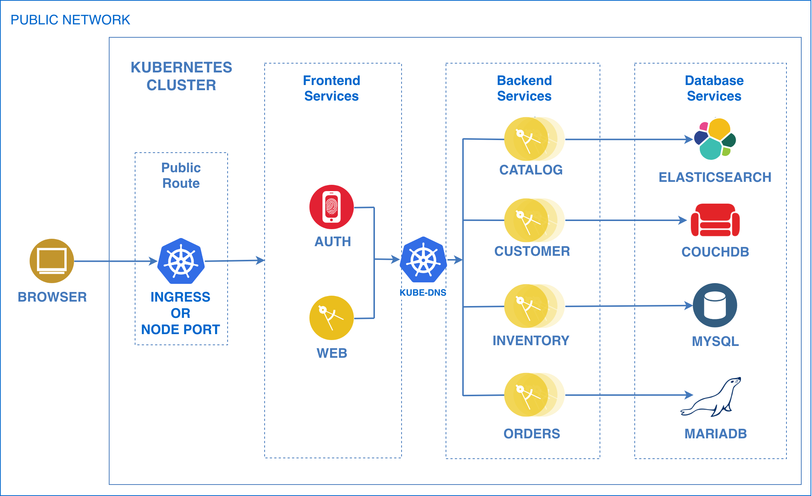

# Deploying BlueCompute into OpenShift

This [README](../bluecompute-ce/README.md) provides the minimal steps to deploy the BlueCompute application into an OpenShift cluster without any persistent storage.  This is intentional to provide a quick starting point with a sample application.   



For more detailed information on BlueCompute application, refer to the [IBM Cloud Native Microservice Application](https://github.com/ibm-cloud-architecture/refarch-cloudnative-kubernetes/blob/spring/docs/openshift/README.md) Github repository.  

For more detailed information on how the BlueCompute YAMLs were generated from existing HELM charts, refer to this [README](https://github.com/ibm-cloud-architecture/refarch-cloudnative-kubernetes/blob/spring/docs/openshift/README.md#deploy-bluecompute-to-openshift).

## Requirements:
- A deployed OpenShift cluster.
- Install the OpenShift CLI `oc`.
- Install the Kubernetes CLI `kubectl`.

## Deploy BlueCompute
1. Create a new project called `bluecompute`.  This will also set the context of your `oc` and `kubectl` CLI to use this project/namespace so you do not need to specify the namespace when running CLI commands.
```
oc new-project bluecompute
```

2. Add Security Context Constraints (SCC) to the `default` Service Account
```
oc adm policy add-scc-to-user anyuid system:serviceaccount:bluecompute:default
oc adm policy add-scc-to-user privileged system:serviceaccount:bluecompute:default
```

3. Deploy BlueCompute
```
git clone git@github.com:ibm-cloud-architecture/gse-devops.git
cd DevOps
cd bluecompute-ce
oc apply --recursive --filename bluecompute-os
```

4. Verify deployment is successful
```
# Check status of the pods.  The full deployment will take ~ 20 minutes.
oc get pods -w

# Expose the web application externally
oc expose svc web

# Retrieve the URL for the BlueCompute application.  
# If you are using a Managed OpenShift cluster on IBM Cloud, the URL will be similar to:
# (web-bluecompute.<cluster name> -ibm-<unique key>.us-south.containers.appdomain.cloud).
oc get route
```

Once all the pods are up and running, you should see something similar to below by running `oc get po`.
You can ignore the pods with Error status.  

```
NAME                                                                    READY   STATUS      RESTARTS   AGE
auth-7d9dd6b655-j2pqx                                                   1/1     Running     0          5d
bluecompute-customer-create-user-eavn9-87p7b                            0/1     Completed   0          5d
bluecompute-customer-create-user-eavn9-m78qm                            0/1     Error       0          5d
bluecompute-inventory-populate-mysql-x3fc9-xsz7j                        0/1     Completed   0          5d
bluecompute-mariadb-0                                                   1/1     Running     0          5d
bluecompute-orders-mariadb-test-22izx                                   0/1     Error       0          5d
catalog-676c768558-ltwbw                                                1/1     Running     0          5d
catalog-elasticsearch-client-856c6b8fc-2x4tr                            1/1     Running     0          5d
catalog-elasticsearch-data-0                                            1/1     Running     0          5d
catalog-elasticsearch-master-0                                          1/1     Running     0          5d
catalog-elasticsearch-master-1                                          1/1     Running     0          5d
customer-844585bd64-vkvld                                               1/1     Running     0          5d
customer-couchdb-couchdb-0                                              2/2     Running     9          5d
inventory-75b58655ff-nsh8s                                              1/1     Running     0          5d
inventory-mysql-7d84694976-cxnbk                                        1/1     Running     0          5d
inventory-mysql-test                                                    0/1     Error       0          5d
orders-84f875dbc7-pxrwm                                                 1/1     Running     0          5d
web-7469bf44c4-kjbsx                                                    1/1     Running     0          5d
```

Open the application URL in a browser and click through the menu items.  You can log in with the account `user / passw0rd`.


## Delete Bluecompute:
```
# Delete the application route
oc delete route web

# Delete all resources using YAML files
oc delete --recursive --filename bluecompute-os
```
